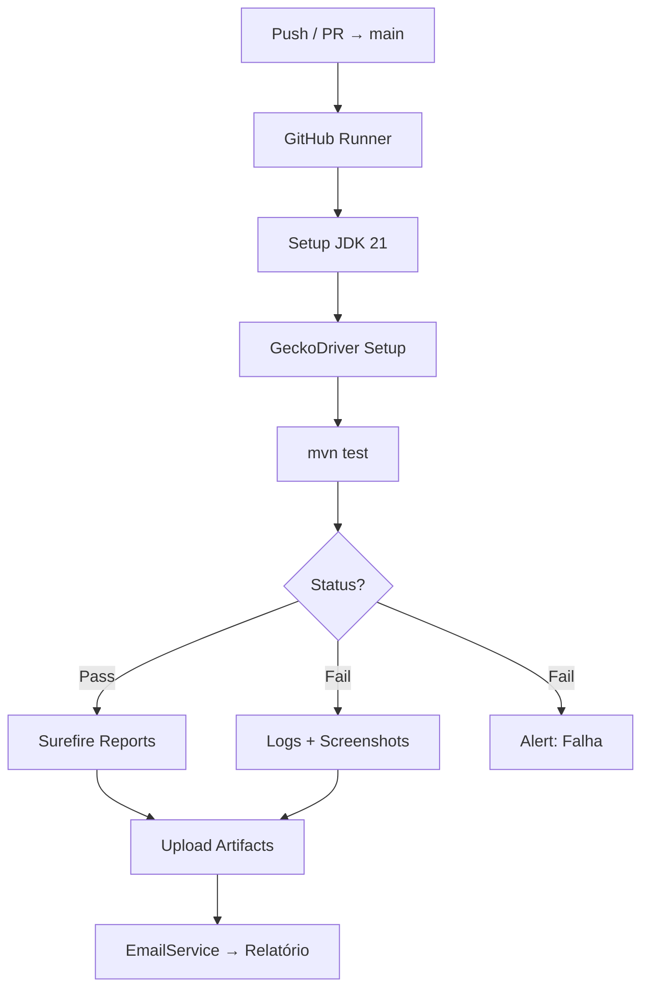

# Argus QA – Automação de Testes E2E para Sistemas Críticos

Engine de automação de testes End‑to‑End focada em **DevSecOps**, **escalabilidade** e **hardening**. Projetada para execução em pipelines CI/CD (GitHub Actions) e também em ambientes isolados (ARM64, sem interface gráfica). Ideal para validar aplicações empresaria
# argus-qa

Engine de automação E2E para o **Guia Doméstico** — cobertura de autenticação, cálculos previdenciários e notificações via pipeline DevSecOps.

---

## Stack

| Camada | Tecnologia | Versão |
|---|---|---|
| Runtime | OpenJDK (ARM64) | 21.0.10 |
| Build | Apache Maven | 3.8.7 |
| Browser | Selenium WebDriver | 4.15.0 |
| Driver | GeckoDriver (aarch64) | 0.33.0 |
| Test Runner | JUnit Jupiter | 5.10.0 |
| SMTP | javax.mail | 1.6.2 |
| CI/CD | GitHub Actions | ubuntu-latest |

---

## Arquitetura

```
argus-qa/
├── .github/workflows/qa-pipeline.yml
├── src/
│   ├── main/java/com/malebolge/sandbox/
│   │   ├── auth/AuthorityChecker.java
│   │   ├── core/GerenciatorPermission.java
│   │   └── core/PrivilegeManager.java
│   └── test/java/dev/malebolge/qa/
│       ├── GuiaDomesticoTest.java
│       └── EmailService.java
└── pom.xml
```



---

## Pré-requisitos

- Java 21 (OpenJDK)
- Maven 3.8+
- Firefox (headless) + GeckoDriver `aarch64`
- Variáveis de ambiente configuradas (ver abaixo)

---

## Configuração de Segredos

### Local

```bash
export QA_EMAIL="user@domain.com"
export QA_PWD="password"
export EMAIL_USER="smtp_user@gmail.com"
export EMAIL_PASS="app_password"
export EMAIL_DEST="target@domain.com"
```

### GitHub Actions — Secrets obrigatórios

| Secret | Descrição |
|---|---|
| `QA_EMAIL` | Login da aplicação alvo |
| `QA_PWD` | Senha da aplicação alvo |
| `EMAIL_USER` | Conta SMTP (Gmail/Outlook) |
| `EMAIL_PASS` | App Password |
| `EMAIL_DEST` | Destinatário dos relatórios |

---

## Execução

```bash
mvn test -Dtest=GuiaDomesticoTest
```

> ARM64 sem display: GeckoDriver em modo headless nativo — `xvfb-run` não necessário.

---

## Cobertura de Testes

## Autenticação e Conta
- [x] Login com credenciais válidas (redireciona para área logada)
- [x] Recuperação de senha – solicitação de link
- [x] Login com credenciais inválidas (mensagem de erro)
- [x] Logout (encerramento de sessão)
- [ ] Bloqueio temporário após 3 tentativas falhas – **N/A**: o sistema Guia Doméstico não implementa bloqueio por tentativas.
- [x] Cadastro de novo trabalhador doméstico (fluxo completo) – **OK**: implementado com e-mail único dinâmico.
- [ ] Alteração de e-mail/senha – **N/A**: o sistema redireciona para recuperação de senha (já testada). Não há alteração direta de senha logado.

## Funcionalidades Core
- [x] Cálculo de guia (INSS, FGTS, multa rescisória) – **OK**: testado via `DiagnosticoConfigTest` (configuração de diagnóstico e folha de pagamento).
- [ ] Geração de extrato para impressão – **N/A**: o programa não oferece essa funcionalidade.
- [x] Simulação de férias + 1/3 – **OK**: validado via página estática `diagnostico_ferias13.php` (valores fixos).
- [x] Cálculo de décimo terceiro – **OK**: incluso na mesma página de férias/13º.

## Relatórios e Notificações
- [x] Envio de e-mail com resultado do teste (EmailService)
- [ ] Download de PDF da guia – **N/A**: não há geração de PDF no programa.
- [ ] Envio de cópia para e-mail do usuário – **N/A**: o sistema não envia cópia do diagnóstico por e-mail (apenas link de recuperação).

## Segurança e Robustez
- [x] Elementos sensíveis não expostos no source (headless) – **OK**: os testes rodam em headless, sem interface.
- [x] Timeout e tratamento de elementos ausentes – **OK**: uso de `WebDriverWait` e cliques via JavaScript.
- [x] Suporte a ambiente headless (CI/CD) – **OK**: pipeline GitHub Actions com Chrome headless.

---

## Segurança — DevSecOps

| Controle | Implementação |
|---|---|
| Zero-Footprint | Nenhuma credencial hardcoded |
| Secret Injection | Env vars locais / GitHub Secrets |
| Ephemeral Runners | Runners descartáveis sem persistência |
| Headless-Only | Superfície de ataque reduzida |
| ARM64 Hardening | GeckoDriver nativo — sem Selenium Manager |

---

## Licença

MIT — veja [`LICENSE`](./LICENSE).
Você quer complementar o README atual, tornando-o mais completo e profissional, sem alterar a estrutura principal. Vou adicionar seções de como executar localmente (com variáveis), configuração do GitHub Actions, estrutura de testes, badges e um roadmap de funcionalidades testadas (checklist). Também incluirei instruções para executar testes específicos e gerar relatórios. O conteúdo final será mantido em um único bloco de código markdown.

Abaixo, o README completo e melhorado:

markdown
# argus-qa

Engine de automação E2E para o **Guia Doméstico** — cobertura de autenticação, cálculos previdenciários e notificações via pipeline DevSecOps.


---

## 📦 Stack

| Camada | Tecnologia | Versão |
|--------|------------|--------|
| Runtime | OpenJDK (ARM64/AMD64) | 21.0.10 |
| Build | Apache Maven | 3.8.7 |
| Browser Automation | Selenium WebDriver | 4.15.0 |
| Driver | ChromeDriver (Selenium Manager) | automático |
| Test Runner | JUnit Jupiter | 5.10.0 |
| SMTP Client | javax.mail | 1.6.2 |
| CI/CD | GitHub Actions | ubuntu-latest |

---

## 🏗 Arquitetura do Projeto
argus-qa/
├── .github/workflows/qa-pipeline.yml # Pipeline CI/CD
├── src/
│ ├── main/java/dev/argus/qa/ # Código de suporte (EmailService)
│ └── test/java/dev/argus/qa/ # Testes organizados por funcionalidade
│ ├── BaseTest.java # Configuração compartilhada (WebDriver, headless)
│ ├── ArgusTest.java # Login, logout, validações gerais
│ ├── LoginInvalidoTest.java # Credenciais incorretas
│ ├── RecuperacaoSenhaTest.java # Solicitação de link de redefinição
│ ├── CadastroUsuarioTest.java # Criação de conta (e-mail único)
│ ├── FeriasDecimoTerceiroTest.java # Validação de valores estáticos
│ └── DiagnosticoConfigTest.java # Configuração + cálculo da folha (fluxo crítico)
├── pom.xml
├── README.md
└── TEST_CHECKLIST.md

text

```mermaid
flowchart TD
    A[Push / PR → main] --> B[GitHub Actions: ubuntu-latest]
    B --> C[Setup JDK 21]
    C --> D[Install Google Chrome]
    D --> E[mvn test -Dtest=ArgusTest]
    E --> F{Tests passed?}
    F -->|Sim| G[Gerar relatórios Surefire]
    F -->|Não| H[Gerar relatórios com falhas]
    G --> I[Upload artefatos]
    H --> I
    I --> J[Enviar e-mail de relatório (EmailService)]
    F -->|Não| K[Enviar e-mail de alerta de falha]
    K --> L[Fim]
    J --> L
🔐 Configuração de Segredos
Local (desenvolvimento)
bash
export QA_EMAIL="seu_email@dominio.com"
export QA_PWD="sua_senha"
export EMAIL_USER="smtp_user@gmail.com"
export EMAIL_PASS="senha_de_aplicativo"
export EMAIL_DEST="destinatario@dominio.com"
# Opcional para testes de cadastro
export TEST_EMAIL="usuario_teste@dominio.com"
GitHub Actions (secrets obrigatórios)
Secret	Descrição
QA_EMAIL	Login da aplicação alvo
QA_PWD	Senha da aplicação alvo
EMAIL_USER	Conta SMTP (Gmail recomendado)
EMAIL_PASS	App password (não a senha normal)
EMAIL_DEST	Destinatário dos relatórios
TEST_EMAIL (opcional)	E‑mail para teste de cadastro
Para Gmail, ative a autenticação de dois fatores e gere uma senha de aplicativo em Segurança da Conta Google.

🚀 Como Executar
Execução local (ARM64 / x86_64)
bash
# 1. Clone o repositório
git clone https://github.com/th1eros/argus-qa.git
cd argus-qa

# 2. Configure as variáveis de ambiente (veja acima)

# 3. Execute todos os testes
mvn test

# 4. Execute uma classe específica
mvn test -Dtest=LoginInvalidoTest

# 5. Execute um método específico
mvn test -Dtest=RecuperacaoSenhaTest#testRecuperarSenha
Nota: Se estiver em ARM64 e o Selenium Manager não funcionar, você pode adicionar as linhas manuais no BaseTest:

java
System.setProperty("webdriver.chrome.driver", "/usr/bin/chromedriver");
System.setProperty("selenium-manager.enabled", "false");
Não faça commit dessas linhas – elas são apenas para ambiente local.

GitHub Actions (CI/CD)
O pipeline é acionado automaticamente a cada push ou pull request para a branch main.
Os artefatos (relatórios Surefire) ficam disponíveis na aba Actions → clique na execução → Artifacts.

📊 Cobertura de Testes (Checklist)
Autenticação e Conta
Login com credenciais válidas (redireciona para área logada)

Recuperação de senha – solicitação de link

Login com credenciais inválidas (mensagem de erro)

Logout (encerramento de sessão)

Bloqueio temporário após 3 tentativas falhas (funcionalidade não existe no Guia Doméstico)

Cadastro de novo trabalhador doméstico (fluxo completo com e-mail único)

Alteração de e‑mail/senha (programa usa recuperação de senha, já testada)

Funcionalidades Core
Cálculo de guia (INSS, FGTS, multa rescisória) – via DiagnosticoConfigTest

Geração de extrato para impressão (não disponível)

Simulação de férias + 1/3 – validação de valores estáticos

Cálculo de décimo terceiro – incluso na mesma página

Relatórios e Notificações
Envio de e-mail com resultado do teste (EmailService)

Download de PDF da guia (não disponível)

Envio de cópia para e-mail do usuário (não disponível)

Segurança e Robustez
Elementos sensíveis não expostos no source (headless)

Timeout e tratamento de elementos ausentes (WebDriverWait)

Suporte a ambiente headless (CI/CD)

🛡 DevSecOps – Hardening
Controle	Implementação
Zero‑Footprint	Nenhuma credencial no código‑fonte
Secret Injection	Env vars locais / GitHub Secrets
Ephemeral Runners	Runners descartáveis sem persistência
Headless‑Only	Superfície de ataque reduzida
ARM64 Hardening	Selenium Manager funciona nativamente (AMD64) – fallback manual opcional
📈 Próximos Passos (Roadmap)
Integrar com Allure Framework para relatórios visuais

Adicionar notificação no Slack / Teams quando o pipeline falhar

Implementar testes de cálculo de rescisão

Criar um Dockerfile para executar testes em qualquer ambiente

Adicionar badge de cobertura com JaCoCo

🤝 Como Contribuir
Faça um fork do repositório

Crie uma branch para sua feature (git checkout -b feature/nova-funcionalidade)

Commit suas mudanças (git commit -m 'feat: adiciona tal teste')

Push para a branch (git push origin feature/...)

Abra um Pull Request para main

📄 Licença
MIT – veja o arquivo LICENSE para detalhes.