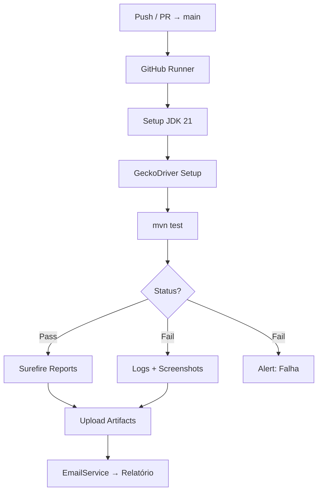

# argus-qa

Engine de automação E2E para o **Guia Doméstico** — cobertura de autenticação, cálculos previdenciários e notificações via pipeline DevSecOps.

---

## Stack

| Camada | Tecnologia | Versão |
|---|---|---|
| Runtime | OpenJDK (ARM64) | 21.0.10 |
| Build | Apache Maven | 3.8.7 |
| Browser | Selenium WebDriver | 4.15.0 |
| Driver | GeckoDriver (aarch64) | 0.33.0 |
| Test Runner | JUnit Jupiter | 5.10.0 |
| SMTP | javax.mail | 1.6.2 |
| CI/CD | GitHub Actions | ubuntu-latest |

---

## Arquitetura

```
argus-qa/
├── .github/workflows/qa-pipeline.yml
├── src/
│   ├── main/java/com/malebolge/sandbox/
│   │   ├── auth/AuthorityChecker.java
│   │   ├── core/GerenciatorPermission.java
│   │   └── core/PrivilegeManager.java
│   └── test/java/dev/malebolge/qa/
│       ├── GuiaDomesticoTest.java
│       └── EmailService.java
└── pom.xml
```



---

## Pré-requisitos

- Java 21 (OpenJDK)
- Maven 3.8+
- Firefox (headless) + GeckoDriver `aarch64`
- Variáveis de ambiente configuradas (ver abaixo)

---

## Configuração de Segredos

### Local

```bash
export QA_EMAIL="user@domain.com"
export QA_PWD="password"
export EMAIL_USER="smtp_user@gmail.com"
export EMAIL_PASS="app_password"
export EMAIL_DEST="target@domain.com"
```

### GitHub Actions — Secrets obrigatórios

| Secret | Descrição |
|---|---|
| `QA_EMAIL` | Login da aplicação alvo |
| `QA_PWD` | Senha da aplicação alvo |
| `EMAIL_USER` | Conta SMTP (Gmail/Outlook) |
| `EMAIL_PASS` | App Password |
| `EMAIL_DEST` | Destinatário dos relatórios |

---

## Execução

```bash
mvn test -Dtest=GuiaDomesticoTest
```

> ARM64 sem display: GeckoDriver em modo headless nativo — `xvfb-run` não necessário.

---

## Cobertura de Testes

### Autenticação e Conta
- [x] Login com credenciais válidas (redirect para área logada)
- [x] Recuperação de senha — solicitação de link
- [x] Login com credenciais inválidas (mensagem de erro)
- [ ] Logout (encerramento de sessão)
- [ ] Bloqueio temporário após 3 tentativas falhas
- [ ] Cadastro de novo trabalhador doméstico (fluxo completo)
- [ ] Alteração de e-mail / senha

### Funcionalidades Core
- [ ] Cálculo de guia (INSS, FGTS, multa rescisória)
- [ ] Geração de extrato para impressão
- [ ] Simulação de férias + 1/3
- [ ] Cálculo de décimo terceiro

### Relatórios e Notificações
- [x] Envio de e-mail com resultado do teste (`EmailService`)
- [ ] Download de PDF da guia
- [ ] Envio de cópia para e-mail do usuário

### Segurança e Robustez
- [ ] Elementos sensíveis não expostos no source (headless)
- [ ] Timeout e tratamento de elementos ausentes
- [ ] Suporte a ambiente headless (CI/CD)

---

## Segurança — DevSecOps

| Controle | Implementação |
|---|---|
| Zero-Footprint | Nenhuma credencial hardcoded |
| Secret Injection | Env vars locais / GitHub Secrets |
| Ephemeral Runners | Runners descartáveis sem persistência |
| Headless-Only | Superfície de ataque reduzida |
| ARM64 Hardening | GeckoDriver nativo — sem Selenium Manager |

---

## Licença

MIT — veja [`LICENSE`](./LICENSE).